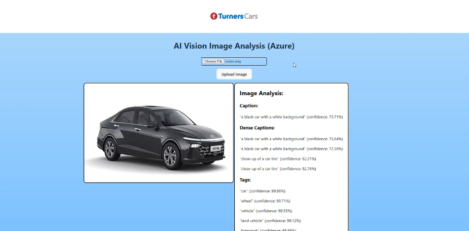

# Mission Ready Level 5 Mission Two Project 🏎️

Turners Cars Prototype: Utilizing Microsoft Azure AI, the 'Similar Cars' feature can identify and recommend motor vehicles based on advanced recognition technology. 

When users upload car images, the backend utilizes Azure AI Vision to analyze them, providing insights such as color and object identification. While the current image analysis tool offers only basic details, this project lays a solid foundation for image analysis tools.

Technologies used include:
- Frontend: React, HTML, CSS, JavaScript
- Backend: Express.js
- Image Analysis: Microsoft Azure AI"

# Images 📷

